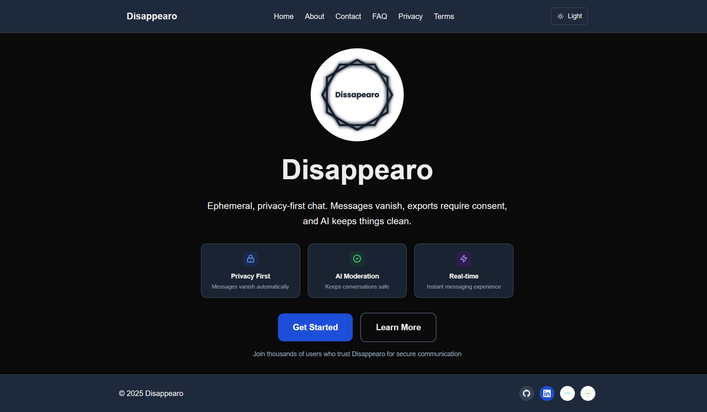

# Disappearo

## Ephemeral Privacy-First Chat

[](https://hackathon.appwrite.network/)
[](https://nextjs.org/)
[](https://reactjs.org/)
[](https://appwrite.io/)
[](https://opensource.org/licenses/MIT)

> **Built for the [Appwrite Sites Hackathon 2025](https://hackathon.appwrite.network/)** - A secure, ephemeral messaging platform where conversations disappear automatically, ensuring complete privacy and data protection.

## 🚀 Live Demo

- **Deployed Site**: <https://disappearo.appwrite.network>
- **GitHub Repository**: <https://github.com/rajjitlai/Disappearo>

## 👤 Author & Credits

- **Author**: Rajjit Laishram (<https://github.com/rajjitai>)
- **Repository**: <https://github.com/rajjitlai/Disappearo>
- **Built with**: Next.js 15, React 19, Tailwind v4, Appwrite
- **Assisted by**: ChatGPT and Cursor AI for code optimization and documentation
- **Logo**: Designed with Canva

## 🎯 Problem & Solution

### The Problem

- 📱 **Permanent Data**: Digital conversations leave permanent traces
- 🔒 **Privacy Concerns**: Data breaches and surveillance risks
- 🚫 **No Control**: Users can't control their conversation data
- ⚠️ **Content Safety**: Harmful content spreads without proper moderation

### Our Solution

- ⏰ **Ephemeral Messaging**: Messages auto-delete after 5 minutes of inactivity
- 🛡️ **Privacy First**: No permanent data storage, complete user control
- 🤖 **AI Safety**: Smart content moderation with progressive enforcement
- 🔐 **Secure Authentication**: Passwordless magic link authentication

## ✨ Features

### Core Features

- **Ephemeral Messaging**: Messages disappear automatically after 5 minutes of inactivity
- **Magic Link Authentication**: Secure, passwordless login via Appwrite
- **Real-time Communication**: Instant messaging with Appwrite Realtime
- **Dual-Approval Exports**: Both participants must consent to save conversations
- **No Message Editing**: Messages cannot be edited after sending to preserve moderation integrity
- **Image Sharing**: Secure image uploads with AI moderation
- **Responsive Design**: Works perfectly on all devices

### Privacy & Security

- **No Data Persistence**: Conversations are truly temporary
- **AI-Powered Moderation**: OpenModerator integration for content safety
- **Strike System**: Progressive enforcement (3 strikes = temporary ban)
- **Auto-Unban**: 10-minute temporary bans with automatic restoration
- **Security Headers**: Comprehensive CSP and security policies
- **Rate Limiting**: API abuse prevention

### User Experience

- **Light/Dark Theme**: System preference detection with manual toggle
- **Emoji Picker**: Enhanced communication with emoji support
- **Loading States**: Smooth user experience with proper feedback
- **Error Handling**: Graceful failure states and recovery
- **Mobile-First**: Optimized for mobile and desktop devices

## 🛠️ Tech Stack

### Frontend

- **Next.js 15**: Latest React framework with App Router
- **React 19**: Modern UI with latest hooks and patterns
- **TypeScript**: Full type safety throughout the application
- **Tailwind CSS v4**: Utility-first styling with custom CSS variables
- **React Hot Toast**: User feedback and notifications

### Backend & Services

- **Appwrite Cloud**: Complete Backend-as-a-Service solution
- **Appwrite Database**: User profiles, messages, and session management
- **Appwrite Realtime**: Live messaging and real-time updates
- **Appwrite Storage**: Secure file uploads and image sharing
- **Appwrite Auth**: Magic link authentication system
- **content-checker**: OpenModerator's TypeScript package for AI content moderation

### Security & Performance

- **Content Security Policy**: XSS prevention and security headers
- **Rate Limiting**: API endpoint protection
- **Input Validation**: Sanitized user inputs and XSS protection
- **Secure Cookies**: SameSite cookie implementation
- **Global CDN**: Fast worldwide delivery via Appwrite Sites

## 🚀 Getting Started

### Prerequisites

- Node.js 18+
- Appwrite Cloud account
- OpenModerator API key (get free at <https://www.openmoderator.com>)

### Installation

1. **Clone the repository**

```bash
git clone https://github.com/rajjitlai/Disappearo.git
cd Disappearo
```

2. **Install dependencies**

```bash
npm install
```

3. **Configure environment variables**
Create a `.env.local` file with the following variables:

```bash
# Appwrite Configuration
NEXT_PUBLIC_APPWRITE_ENDPOINT=your_appwrite_endpoint
NEXT_PUBLIC_APPWRITE_PROJECT=your_project_id
NEXT_PUBLIC_APPWRITE_DATABASE_ID=your_database_id
NEXT_PUBLIC_APPWRITE_PROFILE_COLLECTION_ID=your_profile_collection_id
NEXT_PUBLIC_APPWRITE_CHATREQUESTS_COLLECTION_ID=your_chatrequests_collection_id
NEXT_PUBLIC_APPWRITE_CHATSESSIONS_COLLECTION_ID=your_chatsessions_collection_id
NEXT_PUBLIC_APPWRITE_MESSAGES_COLLECTION_ID=your_messages_collection_id
NEXT_PUBLIC_APPWRITE_BUCKET_ID=your_storage_bucket_id
NEXT_PUBLIC_APPWRITE_BAD_WORDS_COLLECTION_ID=your_bad_words_collection_id
NEXT_PUBLIC_APPWRITE_CONTACT_COLLECTION_ID=your_contact_collection_id

# OpenModerator AI Moderation via content-checker package
# Get your free API key at https://www.openmoderator.com
OPENMODERATOR_API_KEY=your_openmoderator_api_key
USE_OPENMODERATOR_MODERATION=true

# Optional: Disable image moderation for development
DISABLE_IMAGE_MODERATION=false
```

4. **Set up Appwrite Collections**
Follow the [Appwrite Setup Guide](docs/APPWRITE_SETUP.md) to configure your database collections.

5. **Run the development server**

```bash
npm run dev
```

6. **Open your browser**
Navigate to [http://localhost:3000](http://localhost:3000)

## 🏗️ Project Structure

```
disappearo/
├── src/
│   ├── app/
│   │   ├── api/moderate/          # AI moderation API endpoint
│   │   ├── chat/[roomId]/         # Dynamic chat interface
│   │   ├── components/            # Reusable UI components
│   │   │   ├── ui/                # Base UI components
│   │   │   ├── Footer.tsx         # Site footer
│   │   │   ├── MessageBubble.tsx  # Chat message component
│   │   │   ├── MessageInput.tsx   # Message input component
│   │   │   ├── ResponsiveNav.tsx  # Navigation component
│   │   │   └── ThemeToggle.tsx    # Theme switcher
│   │   ├── hooks/                 # Custom React hooks
│   │   ├── lib/                   # Appwrite configuration & utilities
│   │   ├── state/                 # Authentication context
│   │   └── [pages]/               # Application pages
│   ├── middleware.ts              # Security middleware
│   └── globals.css               # Global styles & theme system
├── public/                        # Static assets
├── docs/                          # Documentation (slides, summary, setup)
│   ├── APPWRITE_SETUP.md
│   ├── PRESENTATION_SLIDES.md
│   └── SUBMISSION_SUMMARY.md
├── CHANGELOG.md                   # Changes during hackathon
└── README.md                      # This file
```

## 🔧 Appwrite Setup

### Required Collections

1. **profiles** - User profiles and moderation data
2. **chatrequests** - Chat request management
3. **chatsessions** - Active chat sessions
4. **messages** - Individual messages
5. **bad_words** - Custom moderation word list
6. **contact** - Contact form submissions

### Storage Bucket

- **images** - Secure image uploads with public view access

See [docs/APPWRITE_SETUP.md](docs/APPWRITE_SETUP.md) for detailed setup instructions.

## 🖼️ Screenshots

Home



## 🚀 Deployment on Appwrite Sites

### Prerequisites

- Appwrite Cloud account
- GitHub repository
- Environment variables configured

### Deployment Steps

1. **Connect Repository**
   - Go to Appwrite Console → Sites
   - Click "Create Site"
   - Connect your GitHub repository

2. **Configure Build Settings**
   - Framework: Next.js
   - Build Command: `npm run build`
   - Output Directory: `.next`
   - Node Version: 18+

3. **Set Environment Variables**
   - Add all required environment variables
   - Ensure `NEXT_PUBLIC_` variables are set

4. **Deploy**
   - Click "Deploy" to start the build process
   - Your site will be available at `your-project.appwrite.network`

5. **Custom Domain (Optional)**
   - Configure custom domain in Appwrite Console
   - Update DNS settings as instructed

## 🎨 Theming System

Disappearo features a sophisticated theming system with:

- **CSS Variables**: Consistent color system across components
- **System Preference Detection**: Automatic light/dark mode
- **Manual Toggle**: User-controlled theme switching
- **Smooth Transitions**: Animated theme changes
- **Accessibility**: High contrast and readable colors

### Theme Variables

```css
:root {
  --background: #ffffff;
  --foreground: #171717;
  --card-background: #ffffff;
  --muted: #f3f4f6;
  --border: #e5e7eb;
  /* ... more variables */
}
```

## 🔒 Security Features

### Content Security Policy

- XSS prevention with comprehensive CSP headers
- Frame-ancestors 'none' for clickjacking protection
- Strict script and style source policies

### Authentication Security

- Magic link authentication (no passwords)
- Secure session management
- Automatic session cleanup on logout

### Data Protection

- No permanent message storage
- Automatic data deletion
- Encrypted data transmission
- Input sanitization and validation

### AI Moderation

- Custom bad words filtering
- content-checker package with Google's Perspective API
- Image NSFW detection
- Progressive enforcement system

## 📊 Performance

### Optimization Features

- **Next.js 15**: Latest performance optimizations
- **App Router**: Improved routing and code splitting
- **Image Optimization**: Next.js image component
- **Bundle Analysis**: Optimized JavaScript bundles

### Appwrite Benefits

- **Global CDN**: Fast worldwide delivery
- **Auto-scaling**: Handles traffic spikes
- **DDoS Protection**: Built-in security
- **99.9% Uptime**: Reliable hosting

## 🤝 Contributing

This project was built for the Appwrite Sites Hackathon 2025. While the hackathon version is complete, suggestions and improvements are welcome!

### Development Guidelines

1. Fork the repository
2. Create a feature branch
3. Make your changes
4. Test thoroughly
5. Submit a pull request

## 📄 License

This project is licensed under the MIT License - see the [LICENSE](LICENSE) file for details.
